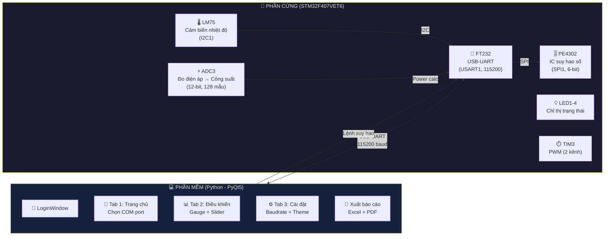
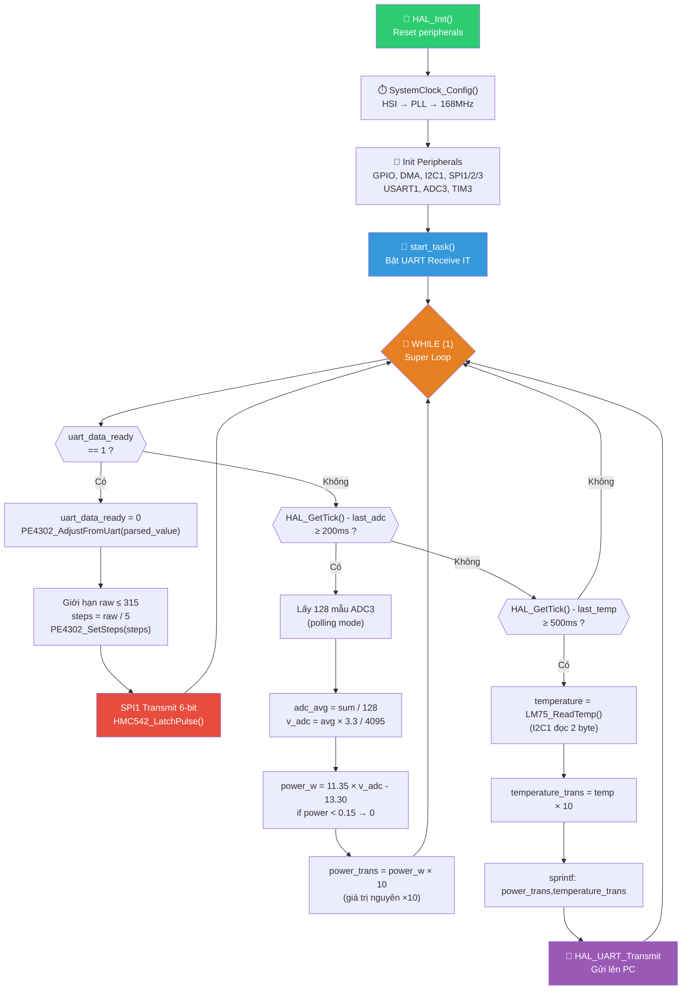
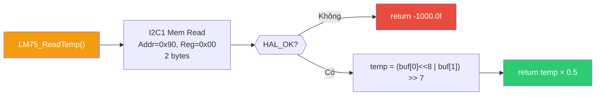
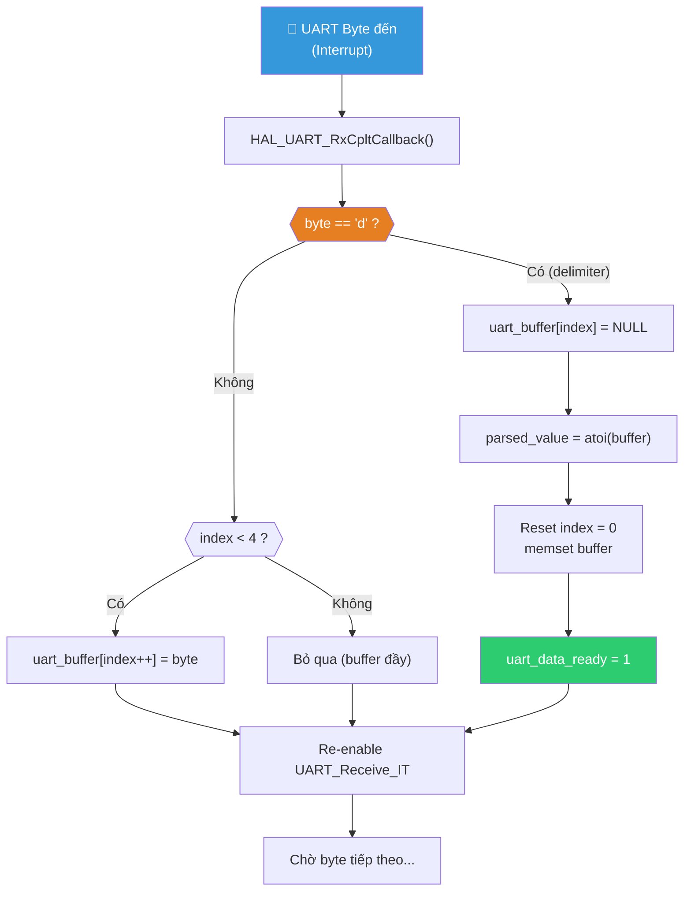
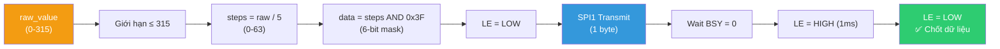
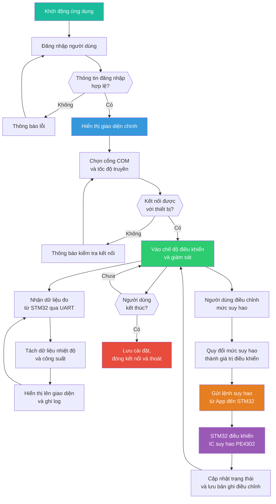
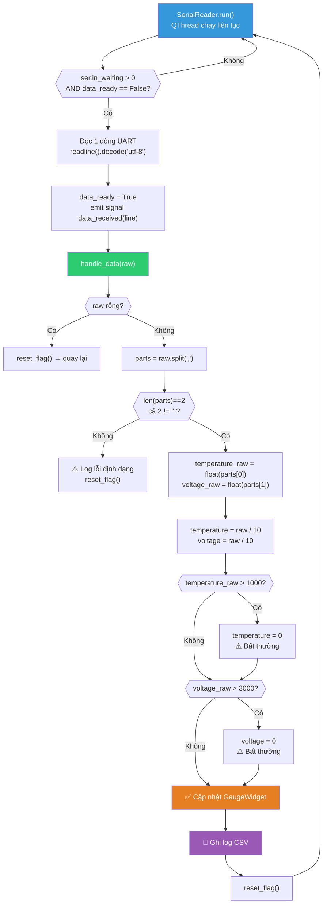
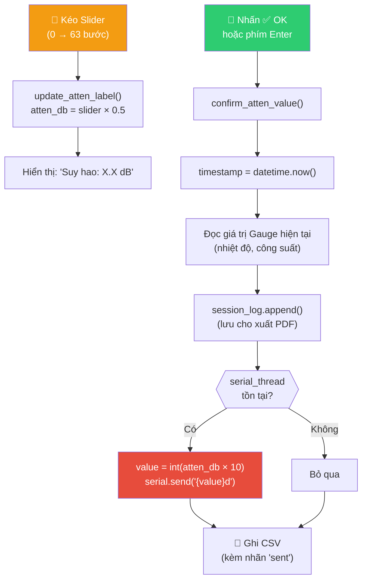
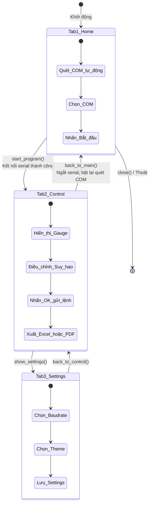

# 📊 PHÂN TÍCH TOÀN HỆ THỐNG K31-TTVT
## Phần mềm Hiển thị Công suất Phát & Điều chỉnh Suy hao Khối Thu Phát Vệ Tinh

> **Tác giả phân tích**: Antigravity AI  
> **Ngày**: 25/05/2026  
> **Phiên bản firmware**: STM32F407VET6 — STM32CubeIDE  
> **Phiên bản app**: Python 3.x — PyQt5  

---

# PHẦN I — TỔNG QUAN HỆ THỐNG

## 1.1 Sơ Đồ Khối Hệ Thống



## 1.2 Bảng Tổng Hợp Thành Phần

| Lớp | Thành phần | Công nghệ | File nguồn |
|-----|-----------|-----------|------------|
| **MCU** | STM32F407VET6 | Cortex-M4, 168MHz, HAL | [main.c](file:///E:/Tuan Document/NCKH TLPK/Thay Phan BMTL/Code/TTVT_K31 F407ver/Core/Src/main.c) |
| **Nhiệt độ** | LM75 (I2C) | I2C1 @ 100kHz, địa chỉ 0x48 | [LM75.c](file:///E:/Tuan Document/NCKH TLPK/Thay Phan BMTL/Code/TTVT_K31 F407ver/Core/Src/LM75.c) |
| **Giao tiếp** | FT232 (USB-UART) | USART1 @ 115200, 8N1, Interrupt | [ft232.c](file:///E:/Tuan Document/NCKH TLPK/Thay Phan BMTL/Code/TTVT_K31 F407ver/Core/Src/ft232.c) |
| **Suy hao** | PE4302 (SPI) | SPI1 Master, 1-line, 6-bit | [main.c L82-111](file:///E:/Tuan Document/NCKH TLPK/Thay Phan BMTL/Code/TTVT_K31 F407ver/Core/Src/main.c#L82-L111) |
| **GUI** | Dashboard (PyQt5) | Python 3.x, multi-tab | [app.py](file:///E:/Tuan Document/NCKH TLPK/pythonProject/app.py) |
| **Đăng nhập** | LoginWindow | Hard-code user/pass | [app.py L818-859](file:///E:/Tuan Document/NCKH TLPK/pythonProject/app.py#L818-L859) |

---

# PHẦN II — FIRMWARE STM32F407

## 2.1 Cấu Hình Clock Hệ Thống

```
Nguồn: HSI (16 MHz nội)
PLL: PLLM=8, PLLN=168, PLLP=2, PLLQ=4
  → SYSCLK = (16/8) × 168 / 2 = 168 MHz
  → AHB  = 168 MHz  (DIV1)
  → APB1 = 42 MHz   (DIV4) — cho I2C1, TIM3, SPI2, SPI3
  → APB2 = 84 MHz   (DIV2) — cho USART1, SPI1, ADC3
```

## 2.2 Bản Đồ Ngoại Vi (Peripheral Map)

| Ngoại vi | Chức năng | Chân GPIO | Cấu hình |
|----------|----------|-----------|----------|
| **I2C1** | Đọc LM75 | PB6 (SCL), PB7 (SDA) | 100kHz, 7-bit addr |
| **USART1** | Giao tiếp FT232 | PA9 (TX), PA10 (RX) | 115200, 8N1, IT |
| **SPI1** | Điều khiển PE4302 | PA5 (SCK), PA7 (MOSI) | Master, 1-line, 8-bit, CPOL=0/CPHA=0, Prescaler=32 |
| **SPI2** | (Dự phòng) | PB13 (SCK), PB14 (MISO), PB15 (MOSI) | Master, 2-lines |
| **SPI3** | (Dự phòng) | PB3 (SCK), PB4 (MISO), PB5 (MOSI) | Master, 2-lines |
| **ADC3** | Đo điện áp công suất | PA2 (Channel 2) | 12-bit, 56 cycles, SW trigger |
| **TIM3** | PWM | PA6 (CH1), PA7 (CH2) | Prescaler=0, Period=65535, PWM1 |
| **GPIO** | LE (Latch) PE4302 | PC4 | Output PP |
| **GPIO** | CHIP_SELECT | PC1 | Output PP |
| **GPIO** | LED1 | PA8 | Output PP |
| **GPIO** | LED2-4 | PC9, PC8, PC7 | Output PP |
| **GPIO** | RESET | PC11 | Output PP |
| **GPIO** | Latch_E | PD0 | Output PP |
| **DMA2** | ADC3 (cấu hình sẵn) | — | Stream0, Priority=0 |

## 2.3 Lưu Đồ Thuật Toán Firmware (main loop)



## 2.4 Module LM75 — Cảm Biến Nhiệt Độ

**File**: [LM75.c](file:///E:/Tuan Document/NCKH TLPK/Thay Phan BMTL/Code/TTVT_K31 F407ver/Core/Src/LM75.c)

```
Giao tiếp: I2C1
Địa chỉ: 0x48 (7-bit) → 0x90 (8-bit, write)
Thanh ghi: 0x00 (Temperature Register)
Dữ liệu: 2 byte, 9-bit resolution
  → temp = (buffer[0] << 8 | buffer[1]) >> 7
  → Kết quả = temp × 0.5°C
  → Độ phân giải: 0.5°C
  → Nếu lỗi I2C → trả về -1000.0f
```



## 2.5 Module FT232 — Giao Tiếp UART

**File**: [ft232.c](file:///E:/Tuan Document/NCKH TLPK/Thay Phan BMTL/Code/TTVT_K31 F407ver/Core/Src/ft232.c)

### Cơ chế nhận lệnh (Interrupt-driven)



### Bảng biến toàn cục UART

| Biến | Kiểu | Kích thước | Mô tả |
|------|------|-----------|-------|
| `uart_rx_byte` | char | 1 byte | Buffer nhận 1 byte interrupt |
| `uart_buffer[]` | char[5] | 5 bytes | Buffer tích lũy chuỗi số |
| `uart_index` | uint8_t | 1 byte | Chỉ số ghi hiện tại |
| `parsed_value` | uint16_t | 2 bytes | Giá trị số sau khi parse |
| `uart_data_ready` | volatile uint8_t | 1 byte | Cờ báo có lệnh mới |

## 2.6 Module PE4302 — IC Suy Hao Số

**File**: [main.c L82-111](file:///E:/Tuan Document/NCKH TLPK/Thay Phan BMTL/Code/TTVT_K31 F407ver/Core/Src/main.c#L82-L111)

```
IC: PE4302 (hoặc tương đương HMC542)
Giao tiếp: SPI1 (Master, 1-line, MSB first)
Dải suy hao: 0 → 31.5 dB
Bước nhảy: 0.5 dB
Độ phân giải: 6-bit (0 → 63 steps)
Latch Enable: PC4 (xung dương để chốt dữ liệu)
```

### Quy trình điều khiển suy hao



## 2.7 Module ADC — Đo Công Suất

**File**: [main.c L172-201](file:///E:/Tuan Document/NCKH TLPK/Thay Phan BMTL/Code/TTVT_K31 F407ver/Core/Src/main.c#L172-L201)

```
Ngoại vi: ADC3, Channel 2 (PA2)
Độ phân giải: 12-bit (0 → 4095)
Sampling time: 56 cycles
Lọc: Trung bình 128 mẫu (software averaging)
Chu kỳ: Mỗi 200ms

Công thức chuyển đổi:
  v_adc = (adc_avg × 3.3) / 4095    (Volt)
  power_w = 11.35 × v_adc - 13.30   (Watt)
  Nếu power_w < 0.15 → 0.0
  power_trans = (uint16_t)(power_w × 10)
```

> **Lưu ý**: Hiện tại trong code có dòng `power_trans=140;` (line 211), đây là **giá trị giả lập cố định** (14.0W) dùng để test. Khi triển khai thực tế cần **xóa dòng này**.

---

# PHẦN III — PHẦN MỀM PYTHON (app.py)

## 3.1 Kiến Trúc Phần Mềm

**File**: [app.py](file:///E:/Tuan Document/NCKH TLPK/pythonProject/app.py) — 874 dòng

| # | Class | Dòng | Vai trò |
|---|-------|------|---------|
| 1 | [resource_path()](file:///E:/Tuan Document/NCKH TLPK/pythonProject/app.py#L31-L35) | 31-35 | Hỗ trợ đóng gói exe (PyInstaller `_MEIPASS`) |
| 2 | [SerialReader](file:///E:/Tuan Document/NCKH TLPK/pythonProject/app.py#L38-L92) | 38-92 | QThread đọc/ghi UART serial |
| 3 | [GaugeWidget](file:///E:/Tuan Document/NCKH TLPK/pythonProject/app.py#L93-L133) | 93-133 | Widget hiển thị gauge (thanh + số) |
| 4 | [Dashboard](file:///E:/Tuan Document/NCKH TLPK/pythonProject/app.py#L135-L815) | 135-815 | Giao diện chính (3 tab ẩn/hiện) |
| 5 | [LoginWindow](file:///E:/Tuan Document/NCKH TLPK/pythonProject/app.py#L818-L859) | 818-859 | Dialog đăng nhập (admin/guest) |

## 3.2 Lưu Đồ Thuật Toán Tổng Quát App



## 3.3 Lưu Đồ Xử Lý Dữ Liệu Serial (Python side)



## 3.4 Lưu Đồ Điều Chỉnh Suy Hao (Python → STM32)



## 3.5 Chuyển Đổi Màn Hình (Tab Navigation)



## 3.6 Chức Năng Xuất Báo Cáo

### Excel — [export_report()](file:///E:/Tuan Document/NCKH TLPK/pythonProject/app.py#L637-L685)
- Đọc file CSV log → Ghi vào Workbook (openpyxl)
- Tự động vẽ biểu đồ LineChart (Nhiệt độ & Công suất theo thời gian)
- Tên file: `report_YYYY-MM-DD_HH-MM.xlsx`

### PDF — [export_pdf()](file:///E:/Tuan Document/NCKH TLPK/pythonProject/app.py#L744-L803)
- Sử dụng thư viện `reportlab`
- Gồm: Logo MTA → Tiêu đề → Bảng dữ liệu `session_log`
- Font Unicode tùy chỉnh (Timenew.ttf)

---

# PHẦN IV — GIAO THỨC TRUYỀN THÔNG

## 4.1 Bảng Giao Thức Chi Tiết

### Chiều STM32 → PC (Dữ liệu sensor)

| Trường | Nội dung | Ví dụ |
|--------|---------|-------|
| **Format** | `"{power_trans},{temperature_trans}\r\n"` | `"140,330\r\n"` |
| **power_trans** | Công suất × 10 (uint16) | 140 → 14.0W |
| **temperature_trans** | Nhiệt độ × 10 (uint16) | 330 → 33.0°C |
| **Chu kỳ** | Mỗi 500ms | — |
| **Delimiter** | `\r\n` | — |

### Chiều PC → STM32 (Lệnh suy hao)

| Trường | Nội dung | Ví dụ |
|--------|---------|-------|
| **Format** | `"{value}d"` | `"105d"` |
| **value** | atten_dB × 10 (int) | 105 → 10.5 dB |
| **Delimiter** | Ký tự `'d'` | — |
| **Dải giá trị** | 0 → 315 | 0.0 → 31.5 dB |

## 4.2 Lưu Đồ Đồng Bộ Giao Thức Hoàn Chỉnh

```mermaid
sequenceDiagram
    participant User as 👤 Người dùng
    participant App as 💻 app.py (PyQt5)
    participant FT232 as 📡 FT232 (USB-UART)
    participant STM32 as 🔧 STM32F407
    participant LM75 as 🌡️ LM75
    participant ADC as ⚡ ADC3
    participant PE as 🎚️ PE4302

    Note over STM32: Super loop bắt đầu

    rect rgb(40, 60, 80)
        Note over STM32,ADC: Mỗi 200ms - Đọc ADC
        STM32->>ADC: HAL_ADC_Start (128 lần)
        ADC-->>STM32: adc_avg
        STM32->>STM32: power_w = 11.35×v - 13.30
    end

    rect rgb(40, 80, 60)
        Note over STM32,LM75: Mỗi 500ms - Đọc nhiệt độ & Gửi PC
        STM32->>LM75: I2C1 Read (2 bytes)
        LM75-->>STM32: temperature (0.5°C res)
        STM32->>FT232: sprintf("140,330\r\n")
        FT232->>App: USB → "140,330"
        App->>App: Parse: Temp=33.0°C, Power=14.0W
        App->>App: Cập nhật GaugeWidget
        App->>App: Ghi log CSV
    end

    rect rgb(80, 40, 40)
        Note over User,PE: Người dùng điều chỉnh suy hao
        User->>App: Kéo slider = 21 (10.5 dB)
        User->>App: Nhấn OK
        App->>App: value = 10.5 × 10 = 105
        App->>FT232: serial.send("105d")
        FT232->>STM32: UART IT nhận từng byte
        Note over STM32: '1','0','5' → buffer<br/>'d' → delimiter
        STM32->>STM32: parsed_value = atoi("105") = 105
        STM32->>STM32: uart_data_ready = 1
        STM32->>STM32: steps = 105/5 = 21
        STM32->>PE: SPI1 Transmit (0x15)
        STM32->>PE: Latch Pulse ↑↓
        PE-->>PE: Suy hao = 10.5 dB ✅
    end
```



## 4.3 Bảng Chuyển Đổi Giá Trị Suy Hao

```
PC (app.py)                    UART              STM32 (main.c)              PE4302
─────────────                  ────              ──────────────              ──────
slider_val = 21                                                              
atten_db = 21 × 0.5 = 10.5                                                 
value = int(10.5 × 10) = 105  →  "105d"  →  parsed_value = 105             
                                              raw_value = 105 (≤315 ✓)      
                                              steps = 105 / 5 = 21          
                                              data = 21 & 0x3F = 0x15  →    10.5 dB ✅
```

---

# PHẦN V — PHÂN TÍCH ĐỒNG BỘ FIRMWARE ↔ APP

## 5.1 Ma Trận Khớp Nối (Coupling Matrix)

| Tham số | Firmware (STM32) | App (Python) | Trạng thái |
|---------|-----------------|--------------|-----------|
| Baudrate | 115200 (hard-code ft232.c:54) | 115200 (default, có thể đổi Settings) | ⚠️ Không đồng bộ nếu user đổi |
| Format gửi sensor | `"%d,%d\r\n"` (power, temp) | `raw.split(',')` → parts[0]=temp, parts[1]=volt | ⚠️ **THỨ TỰ NGƯỢC** |
| Delimiter suy hao | `'d'` (ft232.c:27) | `f"{value}d"` (app.py:567,590) | ✅ Khớp |
| Dải suy hao | 0-315 → 0-63 steps | 0-63 slider → 0-315 value | ✅ Khớp |
| Hệ số nhân | ×10 (main.c:200,209) | ÷10 (app.py:517,518) | ✅ Khớp |

> [!CAUTION]
> ### ⚠️ BUG QUAN TRỌNG — Thứ tự dữ liệu không khớp!
> **Firmware** gửi: `power_trans, temperature_trans` (công suất trước, nhiệt độ sau)  
> **App** nhận: `parts[0]` → gán cho `temperature_raw`, `parts[1]` → gán cho `voltage_raw`  
> → **Nhiệt độ và công suất bị ĐẢO NGƯỢC** trên giao diện!
>
> **Sửa**: Đổi thứ tự trong `handle_data()` hoặc đổi `sprintf` trong firmware.

> [!WARNING]
> ### ⚠️ Baudrate không đồng bộ
> Firmware hard-code 115200 baud. App cho phép user đổi baudrate qua Settings (9600, 19200...).  
> Nếu user chọn baudrate khác 115200 → **mất kết nối**.
>
> **Sửa**: Hoặc lock baudrate ở app = 115200, hoặc thêm cơ chế handshake.

## 5.2 Phân tích điểm yếu giao thức

| # | Vấn đề | Phía | Mức độ | Giải pháp đề xuất |
|---|--------|------|--------|-------------------|
| 1 | Thứ tự power/temp bị đảo | FW ↔ App | 🔴 **Nghiêm trọng** | Đổi `sprintf` hoặc `handle_data` |
| 2 | Không có CRC/Checksum | Cả hai | 🔴 Cao | Thêm CRC8 cuối frame |
| 3 | Không có ACK/NACK | Cả hai | 🟡 Trung bình | Thêm phản hồi `"OK\n"` sau khi nhận lệnh |
| 4 | Baudrate không đồng bộ | App | 🟡 Trung bình | Lock 115200 hoặc handshake |
| 5 | `data_ready` không thread-safe | App | 🟡 Trung bình | Dùng `QMutex` |
| 6 | `power_trans=140` giả lập | FW | 🟡 Test only | Xóa trước khi deploy |
| 7 | Buffer UART chỉ 5 byte | FW | 🟢 Thấp | Tăng lên 8 byte cho an toàn |
| 8 | Không timeout reconnect | App | 🟢 Thấp | Thêm auto-reconnect |

---

# PHẦN VI — ĐỀ XUẤT CẢI TIẾN

## 6.1 Cải Tiến Firmware

| # | Nội dung | Chi tiết |
|---|---------|---------|
| 1 | **Xóa dòng giả lập** | Xóa `power_trans=140;` tại main.c line 211 |
| 2 | **Thêm CRC8** | Gửi `"power,temp,CRC\r\n"` — CRC8 tính trên payload |
| 3 | **Phản hồi ACK** | Sau khi nhận lệnh suy hao, gửi `"ACK:XXd\r\n"` |
| 4 | **Dùng DMA cho ADC** | Thay polling 128 lần bằng DMA circular mode, giảm CPU load |
| 5 | **Watchdog (IWDG)** | Bảo vệ khỏi treo hệ thống |
| 6 | **Tăng UART buffer** | Từ 5 lên ít nhất 8 byte |

## 6.2 Cải Tiến App Python

| # | Nội dung | Chi tiết |
|---|---------|---------|
| 1 | **Sửa thứ tự parse** | `parts[0]` = power (không phải temp) |
| 2 | **Thread-safe flag** | `data_ready` dùng `QMutex` hoặc `threading.Lock()` |
| 3 | **Hash password** | Dùng `hashlib.sha256()` thay hard-code |
| 4 | **Sửa font path** | Dùng `resource_path()` thay `D:\...` |
| 5 | **Refactor tab** | Dùng `QStackedWidget` thay hide/show |
| 6 | **Auto-reconnect** | Phát hiện mất serial → tự kết nối lại |
| 7 | **Lock baudrate** | Đồng bộ với firmware 115200 |
| 8 | **Dọn import trùng** | Xóa import lặp (reportlab, PyQt5) |

## 6.3 Đề Xuất Thêm Frame Protocol

```
Đề xuất frame mới (có CRC8):

STM32 → PC:  "$P{power},T{temp}*{CRC8}\r\n"
             Ví dụ: "$P140,T330*A7\r\n"

PC → STM32:  "$A{value}*{CRC8}\r\n"
             Ví dụ: "$A105*B3\r\n"

STM32 → PC (ACK):  "$ACK{value}*{CRC8}\r\n"
                    Ví dụ: "$ACK105*C1\r\n"
```

---

# PHẦN VII — TÓM TẮT

Hệ thống K31-TTVT gồm **firmware STM32F407** và **ứng dụng PyQt5** hoạt động đồng bộ qua **UART 115200 baud** (USB-UART FT232). Firmware đọc nhiệt độ (LM75 qua I2C) và công suất (ADC3) rồi gửi lên PC mỗi 500ms. App hiển thị dữ liệu trên gauge widget và cho phép người dùng điều chỉnh suy hao (PE4302 qua SPI1, 0-31.5 dB).

**Vấn đề nghiêm trọng nhất cần sửa ngay**: Thứ tự dữ liệu power/temperature bị đảo giữa firmware và app, dẫn đến hiển thị sai giá trị trên giao diện.
